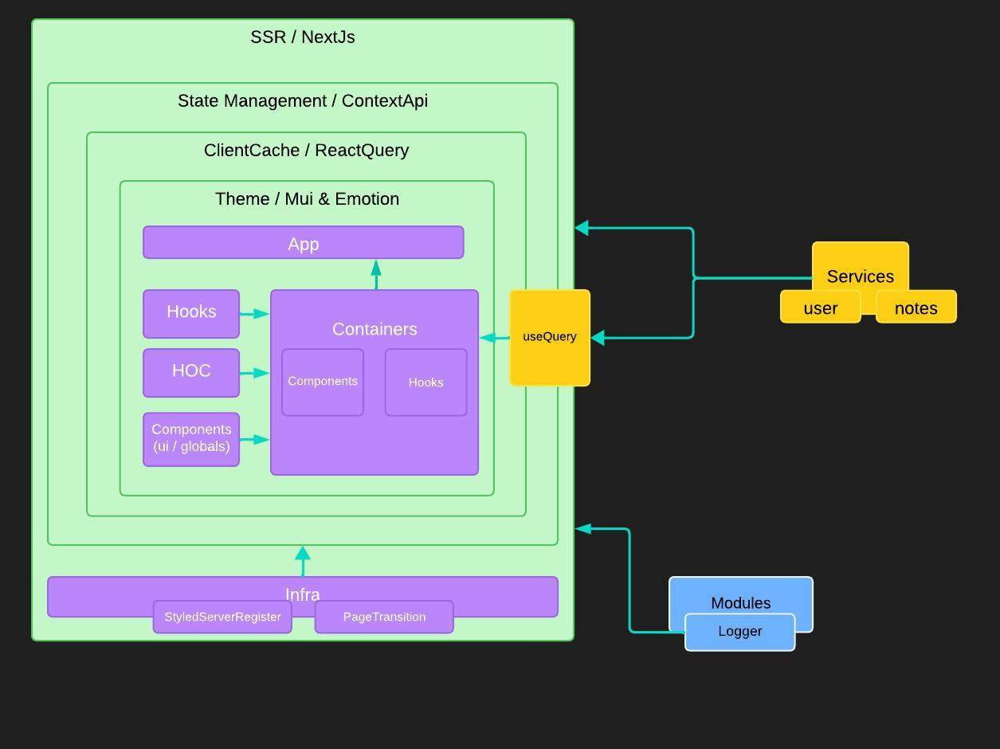

## Architectural diagram


## How to run

First, run the development server:

```bash
npm run dev
# or
yarn dev
# or
pnpm dev
# or
bun dev
```

Open [http://localhost:3000](http://localhost:3000) with your browser to see the result.

## Stack

The project was created using the following stack:

- **MUI** as component library
- **styled-components** for styling
- **Redux** as state management
- **ReactQuery** for data fetching and cache
- **Framer motion** for page animation